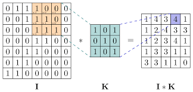

# Extras

## Setup
`pip install numpy pandas sklearn `

## Explanation

In this section, we present additional work beyond the 4 original use cases. Here's what we've done:

* Classification with Adaboost:
Adaptive Boosting, or AdaBoost, is an ensemble Machine Learning algorithm of the boosting type because it processes data sequentially. It improves the performance of any weak learning algorithm, called weak classifiers. The principle is akin to the wisdom of a crowd of experts. Each weak classifier is an expert. Their predictions are then combined into a weighted sum, representing the final prediction of the boosted classifier. AdaBoost is adaptive in the sense that subsequent weak classifiers are adjusted in favor of samples misclassified by previous classifiers.

    

* Convolution from scratch:
Convolution is a step in image processing that involves the product between a kernel and a matrix, which represents our image.

    

  
* A function to split a directory containing images into train and test sets, taking 80% of the images (jpeg, jpg, or png) for training and 20% for testing.
