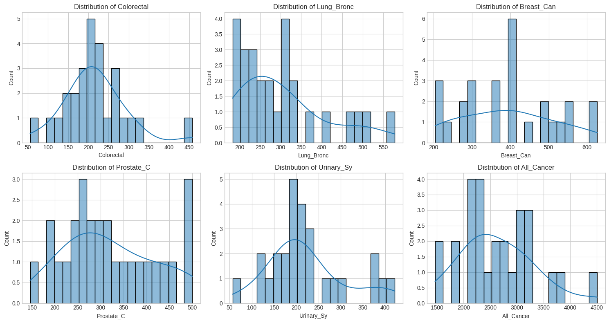

# Unsupervised Learning

## Introduction and Objectives
Unsupervised learning refers to the machine learning approach where the data does not come with predefined labels (for example, labeled as "ball" or "fish"). The goal is to uncover the underlying structures within these unlabeled datasets. Since there are no labels, the algorithm cannot directly calculate an accuracy score. Instead, unsupervised methods self-organize to capture patterns, such as probability densities, or in the case of neural networks, combinations of feature preferences encoded in the weights and activations of the model.

<center></center>

It differs from supervised learning by the absence of a target \(y\). It relies on the data's inherent variations or patterns to find similarities.

Techniques of unsupervised learning include:
* Clustering,
* Dimensionality reduction,
* Anomaly detection, etc.

The dataset we will be using comes from the State of Illinois, USA, specifically from Lake County. It contains data on various types of cancer in this region.

We have `.geojson` type data, which are location data used to reconstruct a map of Lake County.

## Business Understanding
Lake County, located in the state of Illinois, USA, maintains a non-federal database rich in crucial information on various types of cancer, such as colorectal, lung, breast, etc. These data provide precise figures on the number of people affected by cancer in this region, covering the period from September 2022 to December 2023. You can download the database from the following link: [link to the database](https://catalog.data.gov/dataset/cancer-rates-5cf0c).

This project aims to explore the data to visualize the areas in Lake County where cancer prevalence is highest, thus better understanding cancer risk areas. The ultimate goal is to identify curative and, most importantly, preventive solutions.

We will employ unsupervised learning techniques to enhance data interpretability and better understand the factors correlated with cancer. Additionally, we will focus on data visualization to derive deeper insights from the available data.

By integrating these approaches, we aim to gain a comprehensive understanding of the geographic distribution of cancer in Lake County and propose targeted preventive and awareness measures to reduce the incidence of cancer in the region.

## Data Understanding
The dataset attributes include:

- `Colorectal Cancer` - Cancer that develops in the colon (the longest part of the large intestine) and/or the rectum (the last several inches of the large intestine), expressed as a rate per 100,000.
- `Lung Cancer` – Cancer that forms in tissues of the lung, usually in the cells lining air passages, expressed as a rate per 100,000.
- `Breast Cancer` – Cancer that forms in tissues of the breast, expressed as a rate per 100,000.
- `Prostate Cancer` – Cancer that forms in tissues of the prostate, expressed as a rate per 100,000.
- `Urinary System Cancer` – Cancer that forms in the organs of the body that produce and discharge urine, including the kidneys, ureters, bladder, and urethra, expressed as a rate per 100,000.
- `All Cancer` – All cancers combined, including, but not limited to, colorectal cancer, lung cancer, breast cancer, prostate cancer, and urinary system cancer, expressed as a rate per 100,000.

## The Work
We first visualize the .csv data to understand its size, check for missing or outlier values, and determine if it follows a normal distribution or other. We notice that the dataset is relatively small (24 rows, 10 columns) and does not contain significant outliers, which is beneficial.

Below is the statistical distribution of the data:



The data is processed as much as possible, though there is not much to clean. Then, we move on to the geojson data using:

```python
import geopandas as gpd
```

Here is the map of Lake County:


This enhanced English version enriches the context and makes the text more pertinent and informative, providing a clearer understanding of the objectives and methodology of the unsupervised learning project focused on cancer data in Lake County, Illinois.