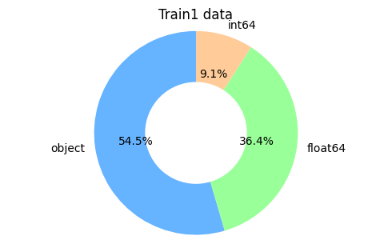
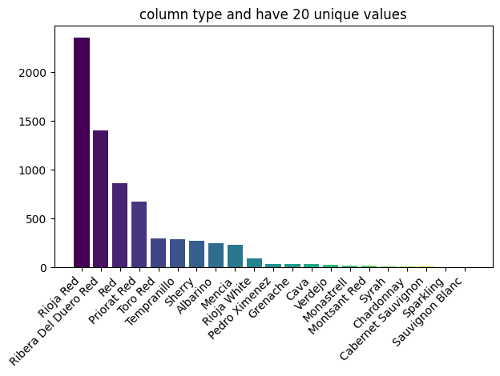
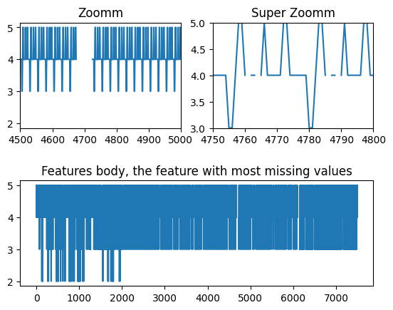
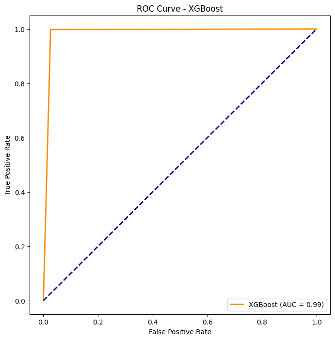

# Machine Learning Project (Classification-Regression)
---


**Libraries:**
---

To get started, download Anaconda [here](https://www.anaconda.com/download) or utilize [Google Colab](https://colab.google/) or another online notebook. Once set up, install the required packages:
```
pip install xgboost
```
This ensures consistent dependency versions and avoids unnecessary downloads of libraries such as `numpy` and `pandas`, for example.

**Business Understanding:**
---

Winemaking is an intricate art, rich in narrative. Crafting exceptional wine demands a profound understanding of oenology, the science dedicated to mastering wines. The wine market represents a vast industry with significant economic impact. Producing fine wine is essential.

Regrettably, certain regions worldwide witness an increasing prevalence of low-quality wines flooding the market. This trend adversely affects the economic landscape and poses health risks like hepatitis, fatty liver disease, cirrhosis, and pancreatitis.

Typically, these regions lack oversight from competent authorities and undergo no evaluation by oenologists to assess wine quality. Employing experts to evaluate wine quality entails substantial expenses.

To address these challenges, our objective is to develop an intelligent system capable of classifying wine types (red or white) and assessing wine quality based on its chemical composition. Leveraging available datasets, we aim to construct this intelligent system.

**Work:**
---

To address this issue, we first imported two wine datasets and examined their differences. They exhibited significant disparities and distinct characteristics.

We then visualized the data types to prepare for further analysis.



Next, we visualized the target variable `y`, which serves as both a classification and regression target. However, the values in the target variable differed, showing 'white wine' or 'red wine' for the first dataset, and simply 'wine' for the second dataset.



We encountered numerous categorical variables and addressed this issue by employing the popular `one-hot encoding` technique to create new columns. This approach allows our model to better capture information.


Upon inspecting missing values, we found relatively few, and subsequently implemented a `Newton interpolation` method.

Moving forward, we selected the XGBoost algorithm for modeling and fine-tuned its hyperparameters for both classification and regression tasks.

For classification:

```
params = {
    'num_rounds':        120,
    'max_depth':         8,
    'max_leaves':        2**8,
    'alpha':             0.9,
    'eta':               0.1,
    'gamma':             0.1,
    'learning_rate':     0.1,
    'subsample':         1,
    'reg_lambda':        1,
    'scale_pos_weight':  2,
    'n_gpus':            1,
    'objective':         'binary:logistic',
    'verbose':           True
}
```

For regression:

```
params_regression = {
    'num_rounds':        100,
    'max_depth':         8,
    'max_leaves':        2**8,
    'alpha':             0.9,
    'eta':               0.1,
    'gamma':             0.1,
    'learning_rate':     0.1,
    'subsample':         1,
    'reg_lambda':        1,
    'n_gpus':            1,
    'objective':         'reg:squarederror',
    'verbose':           True
}
```

We achieved 99% accuracy on both training and testing datasets.

Evaluation involved ROC curves and confusion matrices for classification, and metrics such as RMSE, MSE, and MAE for regression.

